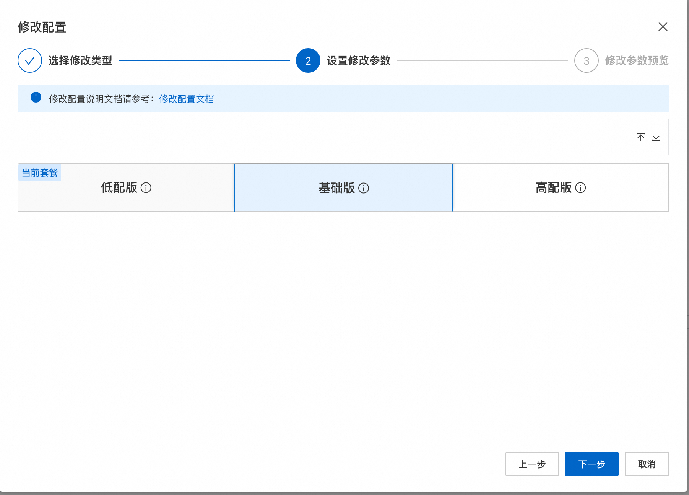
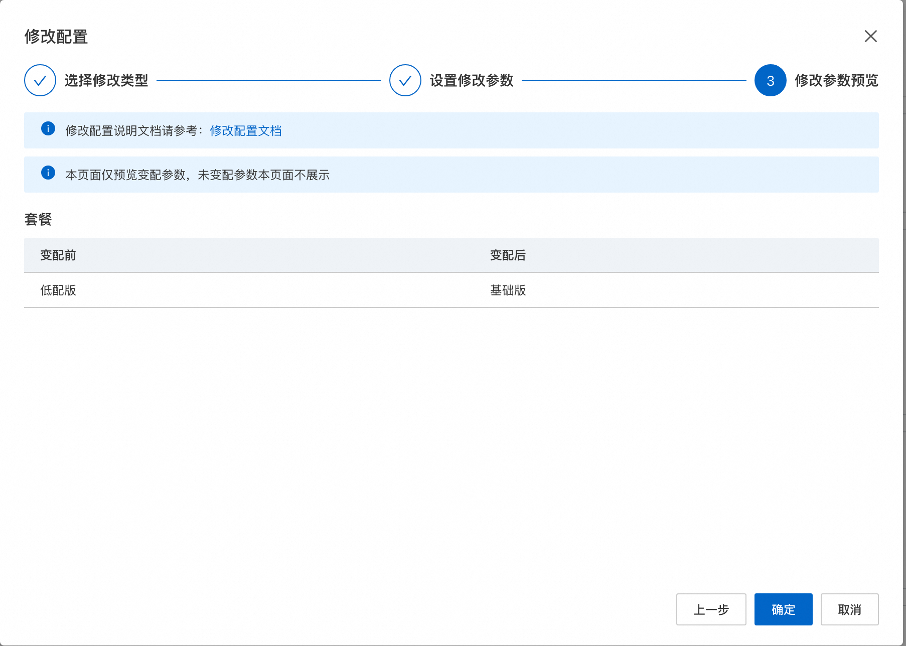
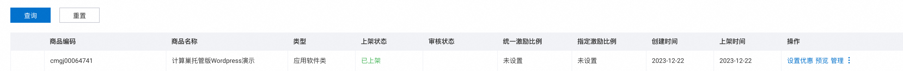
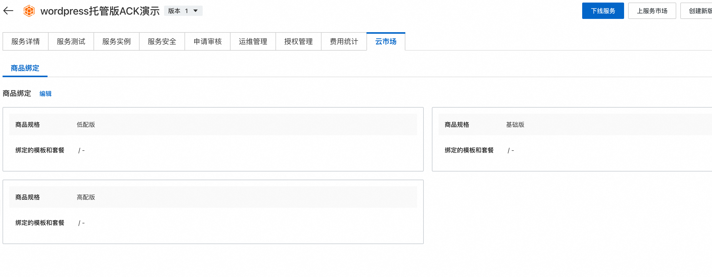

# 服务模板说明文档

## 服务说明

本文介绍容器服务部署wordpress实现托管版多租户的流程，本示例对应的Git仓库地址：[wordpress-managed-ack-yaml-demo](https://github.com/aliyun-computenest/wordpress-managed-ack-demo)。

根据该服务模板构建的服务默认包含三种套餐：

| 套餐名  | vCPU与内存      | 
|--------|----------------|
| 低配版 | 1vCPU 1GiB |
| 基础版 | 2vCPU 2GiB  |
| 高配版 | 2vCPU 4GiB |

本示例需要提前准备ack集群，需要到[容器服务控制台](https://cs.console.aliyun.com/) 提前创建。
本示例创建过程大约持续1分钟，当服务变成待提交后构建成功。

## 服务架构

本部署架构为ACK多租户部署，架构如下图所示：
1. 使用ingress根据域名路由到各个租户的wordpress
2. 每个租户一个k8s namespace，用namespace隔离
3. wordpress和mysql使用yaml部署


## 服务构建计费说明

测试本服务构建无需任何费用，创建服务实例涉及的费用参考服务实例计费说明。

## RAM账号所需权限

本服务需要对ECS、VPC等资源进行访问和创建操作，若您使用RAM用户创建服务实例，需要在创建服务实例前，对使用的RAM用户的账号添加相应资源的权限。添加RAM权限的详细操作，请参见[为RAM用户授权](https://help.aliyun.com/document_detail/121945.html)。所需权限如下表所示：

| 权限策略名称                          | 备注                     |
|---------------------------------|------------------------|
| AliyunCSFullAccess             | 管理容器服务服务（CS）的权限       |
| AliyunROSFullAccess             | 管理资源编排服务（ROS）的权限       |
| AliyunComputeNestUserFullAccess | 管理计算巢服务（ComputeNest）的用户侧权限 |
| AliyunComputeNestSupplierFullAccess | 管理计算巢服务（ComputeNest）的服务商侧权限 |


## 服务实例计费说明

测试本服务在计算巢上的费用主要涉及：

- 导入的ACK集群的费用
- 在ACK集群新建的磁盘、网络等费用


## 服务实例部署流程


### 部署参数说明

| 参数组         | 参数项    | 说明                                             |
|-------------|--------|------------------------------------------------|
| 服务实例        | 服务实例名称 | 长度不超过64个字符，必须以英文字母开头，可包含数字、英文字母、短划线（-）和下划线（_）。 |
|             | 地域     | 服务实例部署的地域                                      |

### 部署步骤

0. 部署链接
 
1. 单击部署链接，进入服务实例部署界面，根据界面提示，填写参数完成部署。
 
2. 参数填写完成后可以看到对应询价明细，确认参数后点击**下一步：确认订单**。
3. 确认订单完成后同意服务协议并点击**立即创建**。
   进入待部署阶段。
    
4. 在用户侧进入待部署状态后需要服务商同意用户的部署。
    
    
5. 等待部署完成后就可以开始使用服务，进入服务实例详情点击Endpoint。
    
6. 部署结果
    


## 服务实例变配流程
   
   

服务实例创建完成后，用户侧有配置修改的需求，可以点击右上角的修改配置进行变配操作，本服务支持的变配操作有以下三种：
1. 扩容磁盘，对wordpress中关联的mysql磁盘进行扩容,磁盘只能进行扩容操作，这里从20Gi扩容到40Gi。
    
    
2. 更改套餐，这个可以对套餐规格进行变更，不同的套餐Pod可用的CPU和内存数量不同。
    
    
3. 更改副本数，这个可以对wordpress副本数进行扩缩容操作。
    
    


## 售卖配置
当前服务因为没有配置售卖链路，所以用户侧部署时候需要服务商的二次确认，当服务上架到阿里云云市场后，就可以不经过服务商的二次确认就可以完成部署。

1. 计算巢服务审核上线。
    上到云市场的商品需要在计算巢这里完成上架过程，走通预发布和发布流程，经过审核后上线。
    
2. 点击到云市场创建商品，选择类目SaaS服务计算巢托管版。
    
    
3. 按要求添商品信息。
4. 在销售信息时候选择预付费模式，并配置三个套餐，给三个套餐配置相应的价格。
    
    
5. 完成商品上线和审核。
    
6. 到计算巢完成套餐和云市场商品的绑定 (如果名字一样会自动匹配上，可以忽略这个步骤)。
    
    
7. 完成部署。
    
    
    
    
8. 至此完成了一个托管版上到云市场并使用的全过程。

## 服务详细说明

通过ALIYUN::CS::ClusterApplication部署yaml到k8s，并给每个租户的对应到不同namespace上。

详细对应到template.yaml的代码片段如下所示：
1. 部署 wordpress + mysql。
2. 部署ingress根据域名将endpoint对应到新创建的wordpress的service上。

通过配置我们完成了基于ack的托管版部署，部署中公用ack的节点池资源。

```yaml
  ClusterApplication:
    Type: ALIYUN::CS::ClusterApplication
    Properties:
      WaitUntil:
        - Kind: Deployment
          Name: wordpress
          JsonPath: $.status.readyReplicas
          Operator: Equals
          Value:
            Ref: ReplicaCount
          Timeout: 300
          ValueType: Json
          FirstMatch: true
        - Kind: Deployment
          Name: wordpress-mysql
          JsonPath: $.status.readyReplicas
          Operator: Equals
          Value: '1'
          Timeout: 300
          ValueType: Json
          FirstMatch: true
      YamlContent:
        Fn::Sub:
          - |
            apiVersion: v1
            kind: Secret
            metadata:
              name: mysql-pass
            data:
              password: bWFyaWFkYg==
            ---
            apiVersion: v1
            kind: Service
            metadata:
              name: wordpress-mysql
              labels:
                app: wordpress
            spec:
              ports:
                - port: 3306
              selector:
                app: wordpress
                tier: mysql
              clusterIP: None
            ---
            apiVersion: v1
            kind: PersistentVolumeClaim
            metadata:
              name: mysql-pv-claim
              labels:
                app: wordpress
            spec:
              accessModes:
                - ReadWriteOnce
              storageClassName: alicloud-disk-essd
              resources:
                requests:
                  storage: ${Storage}
            ---
            apiVersion: apps/v1
            kind: Deployment
            metadata:
              name: wordpress-mysql
              labels:
                app: wordpress
            spec:
              selector:
                matchLabels:
                  app: wordpress
                  tier: mysql
              strategy:
                type: Recreate
              template:
                metadata:
                  labels:
                    app: wordpress
                    tier: mysql
                spec:
                  containers:
                  - image: mysql:8.0
                    name: mysql
                    resources:
                      limits:
                        cpu: ${Vcpu}
                        memory: ${Memory}
                      requests:
                        cpu: ${Vcpu}
                        memory: ${Memory}
                    env:
                    - name: MYSQL_ROOT_PASSWORD
                      valueFrom:
                        secretKeyRef:
                          name: mysql-pass
                          key: password
                    - name: MYSQL_DATABASE
                      value: wordpress
                    - name: MYSQL_USER
                      value: wordpress
                    - name: MYSQL_PASSWORD
                      valueFrom:
                        secretKeyRef:
                          name: mysql-pass
                          key: password
                    ports:
                    - containerPort: 3306
                      name: mysql
                    volumeMounts:
                    - name: mysql-persistent-storage
                      mountPath: /var/lib/mysql
                  volumes:
                  - name: mysql-persistent-storage
                    persistentVolumeClaim:
                      claimName: mysql-pv-claim
            ---
            apiVersion: v1
            kind: Service
            metadata:
              name: wordpress
              labels:
                app: wordpress
            spec:
              ports:
                - port: 80
              selector:
                app: wordpress
                tier: frontend
              type: ClusterIP
            ---
            apiVersion: apps/v1
            kind: Deployment
            metadata:
              name: wordpress
              labels:
                app: wordpress
            spec:
              replicas: ${ReplicaCount}
              selector:
                matchLabels:
                  app: wordpress
                  tier: frontend
              strategy:
                type: Recreate
              template:
                metadata:
                  labels:
                    app: wordpress
                    tier: frontend
                spec:
                  containers:
                  - image: wordpress:6.2.1-apache
                    name: wordpress
                    resources:
                      limits:
                        cpu: ${Vcpu}
                        memory: ${Memory}
                      requests:
                        cpu: ${Vcpu}
                        memory: ${Memory}
                    env:
                    - name: WORDPRESS_DB_HOST
                      value: wordpress-mysql
                    - name: WORDPRESS_DB_PASSWORD
                      valueFrom:
                        secretKeyRef:
                          name: mysql-pass
                          key: password
                    - name: WORDPRESS_DB_USER
                      value: wordpress
                    ports:
                    - containerPort: 80
                      name: wordpress
            ---
            apiVersion: networking.k8s.io/v1
            kind: Ingress
            metadata:
              name: wordpress
            spec:
              rules:
              - host: ${Name}.${ClusterId}.${RegionId}.alicontainer.com
                http:
                  paths:
                  - path: /
                    backend:
                      service:
                        name: wordpress
                        port:
                          number: 80
                    pathType: ImplementationSpecific
          - Name:
              Ref: ALIYUN::StackName
            RegionId:
              Ref: ALIYUN::Region
            ClusterId:
              Ref: ClusterId
      ClusterId:
        Ref: ClusterId
      DefaultNamespace:
        Ref: ALIYUN::StackName
```
helm部署wordpress的方式类似，需要用fluxcd的方式间接的实现，参考template/helm.yaml里的示例。
helm部署的前提是需要安装fluxcd系统。
```shell
helm install fluxcd oci://registry-1.docker.io/bitnamicharts/flux
```
```yaml
ClusterApplication:
    Type: ALIYUN::CS::ClusterApplication
    Properties:
      YamlContent:
        Fn::Sub:
          - |
            apiVersion: source.toolkit.fluxcd.io/v1beta2
            kind: HelmRepository
            metadata:
              name: wordpress
            spec:
              type: oci
              interval: 5m0s
              url: oci://registry-1.docker.io/bitnamicharts
            ---
            apiVersion: helm.toolkit.fluxcd.io/v2beta1
            kind: HelmRelease
            metadata:
              name: wordpress
            spec:
              interval: 5m
              chart:
                spec:
                  chart: wordpress
                  version: '15.4.1'
                  sourceRef:
                    kind: HelmRepository
                    name: wordpress
                  interval: 1m
              values:
                mariadb:
                  primary:
                    persistence:
                      enabled: true
                      storageClass: alicloud-disk-essd
                      size: 20Gi
                persistence:
                  enabled: false
                replicaCount: 1
                service:
                  type: ClusterIP
                ingress:
                  enabled: true
                  hostname: ${Name}.${ClusterId}.${RegionId}.alicontainer.com
                resources:
                  limits:
                    cpu: "${Vcpu}"
                    memory: "${Memory}"
                  requests:
                    cpu: "${Vcpu}"
                    memory: "${Memory}"
          - Name:
              Ref: ALIYUN::StackName
            RegionId:
              Ref: ALIYUN::Region
            ClusterId:
              Ref: ClusterId
            Storage:
              Ref: Storage
            Memory:
              Ref: Memory
            Vcpu:
              Ref: Vcpu
      ClusterId:
        Ref: ClusterId
      DefaultNamespace:
        Ref: ALIYUN::StackName
```


# 更多功能

## 计量计费

[自定义服务架构图](https://help.aliyun.com/zh/compute-nest/customize-a-service-architecture?spm=a2c4g.11186623.0.0.56e736bfyUdlFm])

[服务文档上线流程](https://help.aliyun.com/zh/compute-nest/use-cases/publish-documents-to-compute-nest?spm=a2c4g.313309.0.i0])

[将服务上架云市场并上到云市场售卖](https://help.aliyun.com/zh/compute-nest/publish-a-service-to-alibaba-cloud-marketplace?spm=a2c4g.11186623.0.i7])

## 服务配置

[创建代运维服务完成实例运维](https://help.aliyun.com/zh/compute-nest/create-a-hosted-operations-and-maintenance-service?spm=a2c4g.11186623.0.i24#task-2167552])

[创建包含变配功能的服务](https://help.aliyun.com/zh/compute-nest/use-cases/create-a-service-that-supports-specification-changes-and-change-the-specifications-of-a-service-instance?spm=a2c4g.11186623.0.i3])

[创建包含服务升级功能的服务](https://help.aliyun.com/zh/compute-nest/upgrade-a-service-instance?spm=a2c4g.11186623.0.i17#task-2236803)